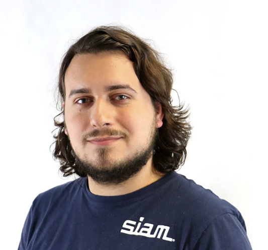

I am a postdoctoral scholar in the [Farhat Research Group](https://web.stanford.edu/group/frg/) at Stanford University. I am working on the development of a generative design framework for solution field interpolation using snapshot data. This framework can be used to construct surrogate models that predict scalar fields at unseen parameter vectors, reducing the need for expensive high-fidelity simulations in the design of aircraft.

I received my Ph.D. from the
[Department of Computational Applied Mathematics and Operations Research](https://cmor.rice.edu/) (CMOR) at 
Rice University in Houston, TX. My dissertation focused on adaptive surrogate model refinement for simulation and optimization of dynamical systems with expensive-to-evaluate component functions.

I am currently pursuing faculty positions in mathematics.

Here is my [CV](cv.pdf).

### Contact Information 
- **Office**: Durand Building 211, Stanford University
- **Email**: jcange@stanford.edu
