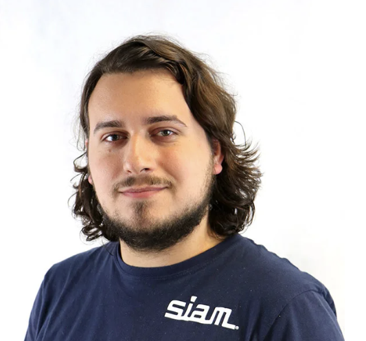

I am a postdoctoral scholar in the [Farhat Research Group](https://web.stanford.edu/group/frg/) at Stanford University. I am collaborating with a graduate student on the development of a generative design framework for solution field interpolation using snapshot data. This framework can be used to construct surrogate models that predict scalar fields at unseen parameter vectors, reducing the need for expensive high-fidelity simulations in the design of aircraft.

I received my Ph.D. from the
[Department of Computational Applied Mathematics and Operations Research](https://cmor.rice.edu/) (CMOR) at 
[Rice University](https://www.rice.edu/) in Houston, TX.

Here is my [CV](cv.pdf).

### Contact Information 
- **Office**: Durand Building 211, Stanford University
- **Email**: jcange@stanford.edu

## Research Interests
- Optimal control
- Scientific machine learning
- Data-driven surrogate modeling
- Experimental design + data acquisition

